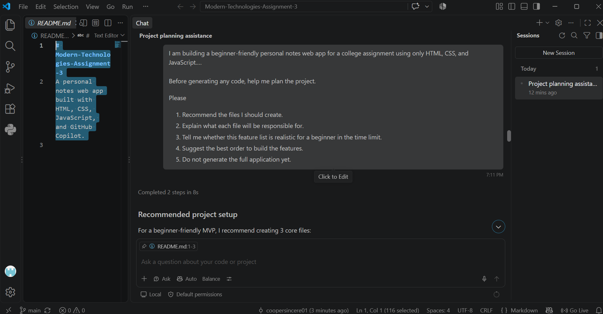
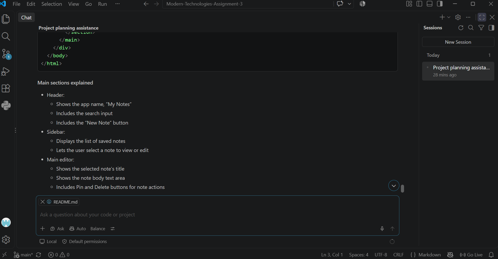
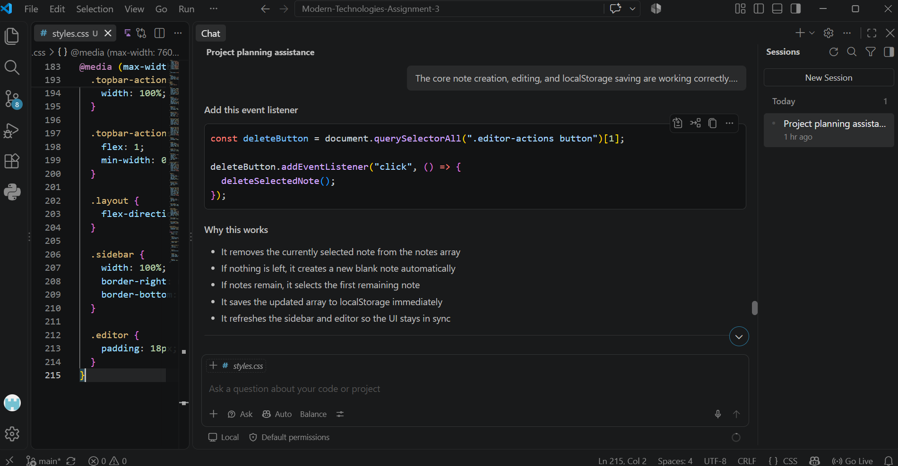
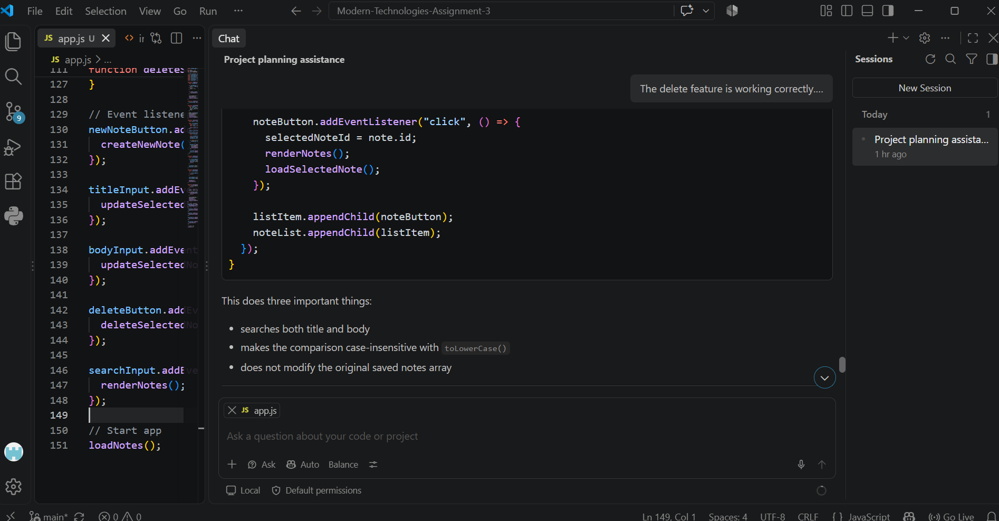
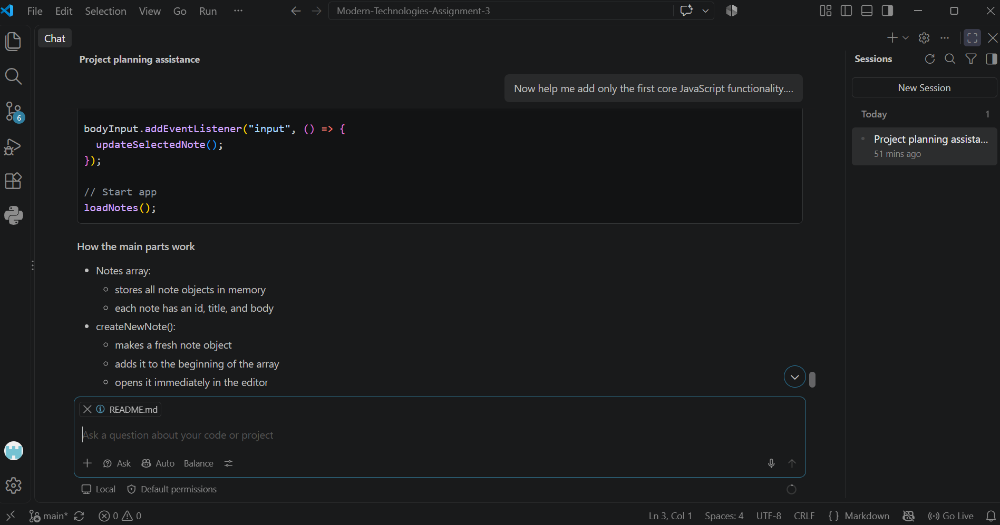
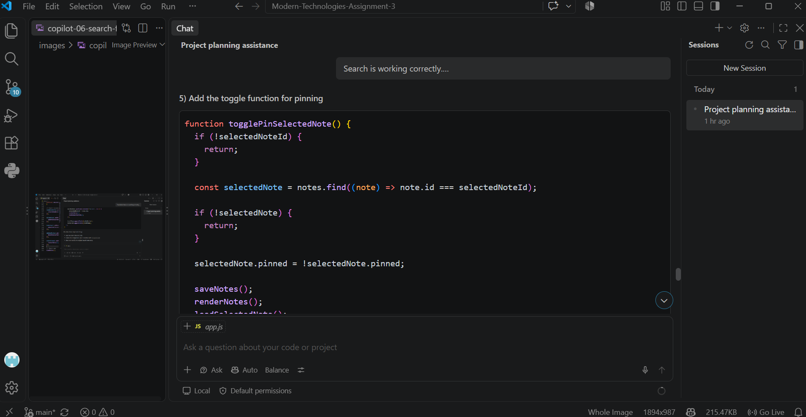
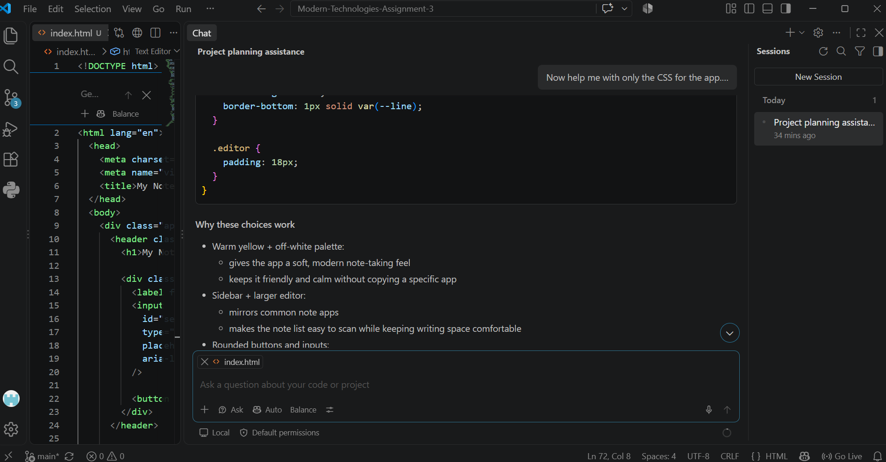
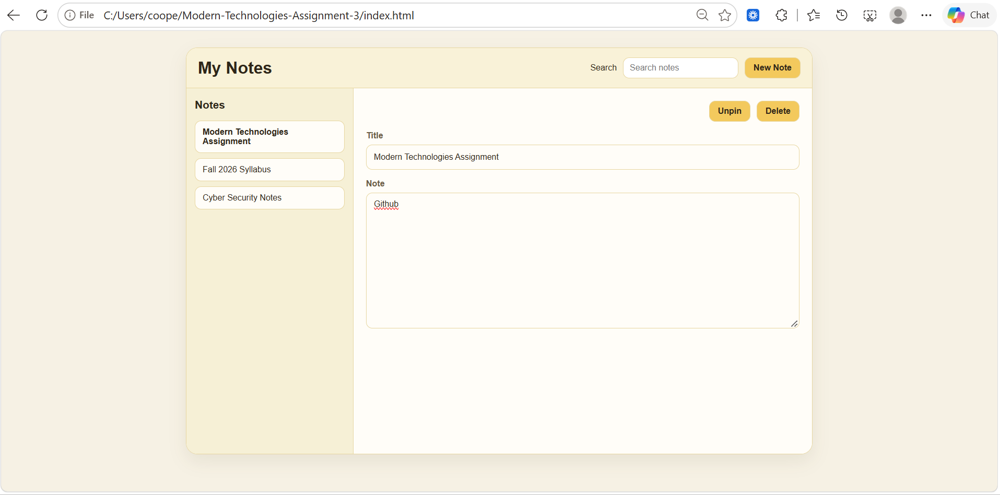
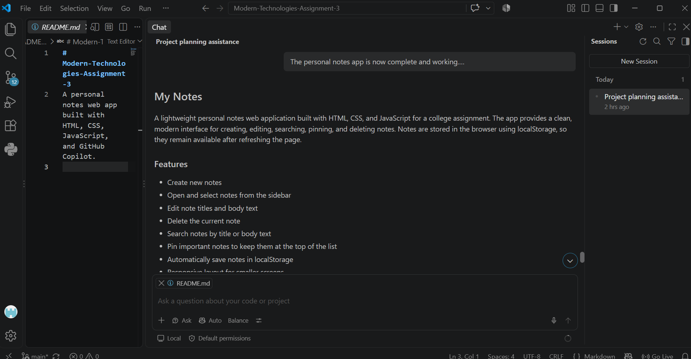

# Reflection

## 1. What did you ask Copilot to help build? How did you break down the problem?

I asked GitHub Copilot to help me build a personal notes app using HTML, CSS, and JavaScript. I wanted something simple but still actually useful so the main features I chose were creating and editing notes, deleting them, searching through them, pinning important notes, and saving everything so it would still be there after refreshing the page. I didn't ask Copilot to build the whole thing in one prompt. I started by asking it to help me plan the project first including what files I needed and what order I should build everything in. From there I did the HTML structure, the CSS design, and then moved into JavaScript. Once I got to JavaScript I broke that down even more. I started with creating and editing notes and localStorage, tested that, and then added delete, search, and pinning one at a time. Doing it that way made the project way easier to follow because I could actually see what each new piece of code was doing instead of getting one huge block of code and hoping it worked.

## 2. How did your approach to asking Copilot questions change?

My prompts definitely got more specific as I worked through the project. At the beginning I was mainly explaining what kind of app I wanted and asking Copilot to help me figure out the structure. Once I started building I realized it worked better when I told Copilot exactly what feature I wanted next and also what I did not want it to change. For example, when I asked for the delete feature I specifically told it to only work on deleting the selected note and not add search or pinning yet. I did the same thing for search and pinning. I also started telling it things like not to redesign my HTML or CSS and to keep the JavaScript beginner-friendly. That helped keep the project under control instead of Copilot changing a bunch of things at once. I also learned that I shouldn't automatically copy everything Copilot gives me. During the search feature Copilot gave me a "full relevant updated section" but I added the search changes into my existing JavaScript instead of replacing everything because I didn't want to accidentally remove functions that were already working. That made me pay more attention to the code instead of treating Copilot like a copy-and-paste tool.

## 3. What surprised you about working with Copilot?

What surprised me the most was how much easier it was to build features when I explained exactly what I wanted. I expected Copilot to mostly autocomplete small pieces of code, but it was able to help with the actual logic behind the app too. For example, it helped me use localStorage so my notes stayed saved after I refreshed the browser. It also helped make pinned notes move to the top and change the Pin button to Unpin depending on the note. Another thing that surprised me was that the first answer wasn't always something I should just paste directly into my project. I still had to look at what it was changing, test it, and make sure it worked with the code I already had. That was probably one of the biggest things I got out of this assignment. Copilot can make programming faster, but I still have to understand enough about my project to know where the code belongs and whether the suggestion makes sense.

## 4. What did you learn about the technology you used?

The biggest thing I learned was how HTML, CSS, and JavaScript actually work together in one application. HTML gave me the structure of the notes app, CSS controlled how everything looked, and JavaScript made the buttons and notes actually do something. I also learned more about localStorage. Before this project I didn't really think about how a basic web app could remember information without having a database. In this app the notes are stored in the browser so when I edited a note, refreshed the page, and saw that the note was still there, I could actually see what localStorage was doing. I also got more practice with JavaScript arrays, event listeners, filtering, and updating information on the page. The search feature uses filtering to decide which notes should show in the sidebar while pinning changes a property on a note and then changes the order the notes are displayed in. Seeing those things work inside an actual app made more sense to me than only seeing them as separate examples in code.

## 5. What would you do differently next time?

Next time I would still break the project down feature by feature because that worked really well, but I would probably plan my JavaScript structure a little more before I started adding features. As the app grew more functions started depending on each other so having a clearer plan for the data and buttons from the beginning would make adding new features easier. I would also keep testing after every small change like I did toward the end of this project. Testing the New Note button, refreshing the page to make sure localStorage worked, deleting notes, searching, and then checking that pinned notes stayed pinned helped me catch problems before moving forward. I would also keep being specific with Copilot instead of asking something broad like "build this app." Giving it one feature at a time and telling it what not to change gave me much better results and made it easier for me to understand what was happening. I would use Copilot again, but more as something I work with and check instead of something I expect to do the entire project for me.

